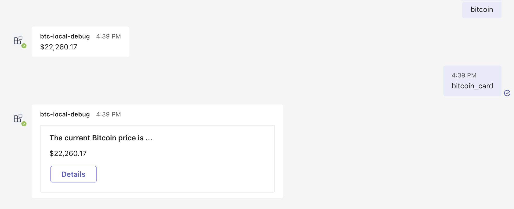

# Teams Bot - btc

Example app showing how Teams' Bot's commands are added and results are rendered with AdaptiveCards

## Usage

### Prerequisite

- Nodejs (Use v16+)
- VSCode
  - [Teams Toolkit](https://marketplace.visualstudio.com/items?itemName=TeamsDevApp.ms-teams-vscode-extension)
- [Microsoft 365 Developer account](https://developer.microsoft.com/en-us/microsoft-365/dev-program)
  - Mobile app: [Authenticator](https://www.microsoft.com/en-us/security/mobile-authenticator-app)

### Setup and usage

1. `git clone git@github.com:jk-msft/msft-teams-tutorials-bot-btc.git`
2. Open the project in VSCode
3. Click Run and Debug button in the left sidebar
4. Click Run "Debug (Edge)".
5. Wait...
6. "Add" the Bot once the installation popup shows up in the Teams app.
7. Try out the following commands

- `bitcoin`
- `bitcoin_card`

